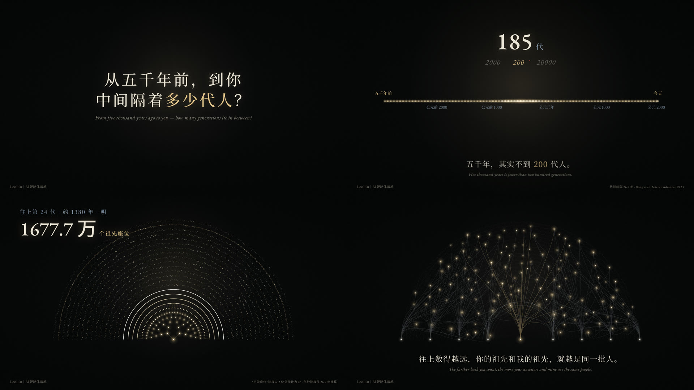

# leoliu-code-film

**用 AI 写代码拍短片：每一帧画面和配乐都是代码生成的，不用视频模型，也不用生图。**

一个给 Claude Code / Codex 用的 Skill。仓库里两个示例片都是用它做的：

- **故事短片《国庆回家路》**（61 秒）：车窗里的场景是 Canvas 2D，过黄河、过长江的航拍是 Three.js 3D，配乐用 numpy 合成。
- **知识短片《上下五千年》**（108 秒，4K 60 帧）：从“五千年隔着多少代人”一步步算到“往上数，我们是一家人”；字幕和图解是 SVG／DOM，光点是 Canvas，五声音阶配乐也是代码合成，没有配音。

都由 HyperFrames 渲染成 MP4。


同一个模型，一句话写出来是左上那样；按这个 Skill 的流程走，是右下那样。为什么差这么多，见 [docs/why-one-prompt-fails.md](docs/why-one-prompt-fails.md)。



## 教程

跟着视频教程一课一课做（图文版放在 `docs/tutorial/`）：

1. [第 1 课：它不是生成视频，是写代码——5 分钟做出第一条](docs/tutorial/01-first-video.md)

## 它做什么

把“做一部代码短片”拆成固定步骤，让 AI 按顺序做，每一步做完给你看：

1. **故事和分镜表**：故事短片先定人物、期待和落点，不做地名清单或风格合集；知识短片先过选题四问，每 5–10 秒给一个小答案，隔一会儿让观众猜一次。
2. **风格帧关**：先渲 3 张定稿质量的静帧，你点头了才做动画。
3. **搭工程**：2D 画布场景、Three.js 3D 镜头、GSAP 时间轴。每一帧只由时间决定，可以逐帧渲染。
4. **代码写谱，真乐器演奏**：和弦、琶音、环境声、转场重音都在代码里；先用合成音对齐画面，定稿后换成 CC0 的真乐器录音（竖琴、钟琴、大提琴组……），没有版权问题。
5. **自检至少两轮**：技术检查＋手机小窗看静帧，按“好不好看”改。
6. **渲染交付**：压缩、响度统一到 -16 LUFS。

## 安装

需要 Node.js 22+、ffmpeg、[uv](https://docs.astral.sh/uv/)（用来跑 Python 配乐脚本），以及能联网下载依赖。

**Claude Code**（个人 Skill）：

```bash
git clone https://github.com/xiaoliuxiansheng648648-afk/leoliu-code-film ~/leoliu-code-film
ln -s ~/leoliu-code-film ~/.claude/skills/leoliu-code-film
```

**Codex**：同样把目录链接到 `~/.codex/skills/leoliu-code-film`。

装好后直接说需求，例如：“用 leoliu-code-film 做一部 45 秒的中秋短片，讲一个人在外地加班”。

## 先跑一遍示例

```bash
cp -r examples/guoqing-train-home my-film
bash scripts/fetch-vendor.sh my-film      # 下载 Three.js、GSAP、字体（不随仓库分发）
cd my-film
uv run music.py                            # 合成配乐 → assets/audio/music.wav
npx -y hyperframes@0.8.77 snapshot --at 0,20,29,45,57 --no-end   # 先看几张静帧
npx -y hyperframes@0.8.77 render -o raw.mp4 --fps 30 --quality delivery --video-frame-format png
```

知识短片示例：

```bash
cp -r examples/wuqiannian my-knowledge-film
bash scripts/fetch-vendor.sh my-knowledge-film   # GSAP、Noto Serif SC、EB Garamond
cd my-knowledge-film
python3 build.py                                # 改 src/ 后重新生成 index.html
uv run music.py
npx -y hyperframes@0.8.77 snapshot --at 0,20.6,52.3,68.9,98.8 --no-end
# 想听真乐器版：bash ../scripts/fetch-samples.sh && uv run music_real.py（覆盖 music.wav）
npx -y hyperframes@0.8.77 render -o raw.mp4 --fps 60 --resolution 4k --quality delivery
```

《国庆回家路》原片开头有一句人声（“这趟回家的路，每一帧，都是 AI 写代码画出来的”），用的是作者自己的配音，没有放进仓库。想要的话，用任意 TTS 生成 `assets/audio/vo.wav`（约 3.4 秒），再在 `index.html` 的音频元素里加一行：

```html
<audio id="vo" src="assets/audio/vo.wav" data-start="0.15" data-duration="3.44" data-track-index="10" data-volume="1"></audio>
```

## 目录

```text
SKILL.md                      # 给 AI 看的流程
references/                   # 故事与风格、知识短片、搭工程、配乐渲染自检、踩过的坑
examples/guoqing-train-home/  # 故事短片示例完整源码
examples/wuqiannian/          # 知识短片示例完整源码（src/ 改完运行 build.py）
scripts/fetch-vendor.sh       # 下载第三方运行文件
docs/                         # 对比图、风格帧、为什么一句话做不好
```

## 边界

- 擅长插画感、剪影、光影氛围、3D 大场面、动态图形；不擅长写实真人。
- 一部 60 秒左右的片子，示例从开工到成片花了 6 个多小时，改了 5 版；知识短片示例从写简报到成片约 5 小时，中间先做了 40 秒样片。别指望一句话出片。
- 渲染在本机进行（M1 Max）：61 秒带 3D 的片子约 3 分钟；108 秒 4K 60 帧约 31 分钟。

## 许可

代码和文档：MIT（见 [LICENSE](LICENSE)）。用到的第三方组件和各自的许可见 [THIRD_PARTY_NOTICES.md](THIRD_PARTY_NOTICES.md)。

作者：LeoLiu｜AI智能体落地
